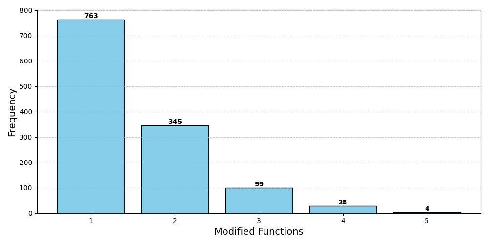

# TutorCode & CREF

## I) TutorCode
The benchmark **Tutorcode** consists of 1,239 incorrect C++ codes written by 427 distinct authors and associated information such as tutor guidance, solution description, failing test cases and the ground truth corrected code.

> To prevent data leakage, the dataset is not placed directly in this directory. TutorCode can be accessed via the API using the script provided below. While it is possible to store the data locally at your convenience, uploading it to the public web is prohibited.

### A. Fetch data

The dataset can be **accessed** through the provided script (without additional requirements or configurations):
```
python3 tutorcode_api.py fetch {id}
```

where `{id}` represents the unique identifier of the sample within the TutorCode, ranging from `1` to `1239`. The script includes a pre-configured `API_KEY`. After execute `python3 tutorcode_api.py fetch 611`, the result shows in [611.json](611.json). The structures are as follow:

```
{
    "incorrectCode": "...",  // the incorrect code to fix
    "problemId": 62650,  // there are 35 distinct problem ids
    "problemDescription": "...", // the problem description in Markdown format
    "judgeResult": {},  // judge result json, including compiling erorr messages, count of test cases, execution time and memory usage for each test case, etc.
    "tutorGuidance": "...",  // the tutor guidance in Markdown format
    "solutionDescription": "...", // the solution description in Markdown format
    "groudTruthCode": "...",  // the ground truth corrected code
    "userOut": "4\n",  // the output of the incorrect code for the first failing test case
}
```

TutorCode includes incorrect codes samples that vary widely in accuracy, from nearly correct to those requiring substantial modification. The following figure illustrates the count of distinct functions in the incorrect codes compared to the ground truth corrected codes within TutorCode.



Additionally, the subsequent figure displays the count of differing code segments (hunks) between the incorrect codes and the ground truth corrected codes in TutorCode.


### B. Fetch test cases
To minimize the risk of data leakage, we provide a separate script to fetch test cases:

```
python3 tutorcode_api.py testcase {problem_id} {case_id}
```

For example, after we execute `python3 tutorcode_api.py testcase 62650 5`, the result shows as bellow:

```
{
    "input": "3 3 2 2 4 5\n1 -100 1\n-100 0 -100\n1 -100 1\n",
    "output": "-1\n"
}
```

### C. Judge codes
The generated code can be judged through the following script:

```
python3 tutorcode_api.py judge {problem_id} {code_file}
```

For example, we can execute `python3 tutorcode_api.py judge 62650 62650.cpp` to judge the code in [62650.cpp](62650.cpp). The judge result is the same as the `judgeResult` field in [611.json](611.json).

## II) Requirements

1. You should install llvm-16 for calculating RPSR results, and set the llvm directory like `/usr/lib/llvm-16/lib/libclang.so.1` within `settings.py`.

2. Install python libraries:

```
pip install -r requirements.txt
```

3. Set the values in the `settings.py`, such as OpenAI api_key.

## III) Experiments
**C**onversational **RE**pair **F**ramework, an LLM-based conversational program repair framework.

### A) Sec. 3.3 (Dataset Statistics)
```
python3 tutorcode_statistic.py
```
This script calcuates the statistics of TutorCode dataset, including the code length and diff hunks of incorrect codes.

### B) Sec. 4.1 (RQ1: Realistic Performance of LLMs)

```
python3 experiment.py 5 default gpt-4-0613
python3 experiment.py 5 default gpt-3.5-turbo-0613
python3 experiment.py 5 default claude
python3 experiment.py 5 default bard
python3 experiment.py 5 default codellama
python3 experiment.py 5 default starchat
python3 experiment.py 5 default vicuna
python3 experiment.py 5 default codegen16b
python3 experiment.py 5 default codegen6b
python3 experiment.py 5 default codet5p
python3 experiment.py 5 default incoder
python3 experiment.py 5 default replit
```

The scripts evaluate the repair capabilities of LLMs using the TutorCode benchmark. They assess performance based on several metrics: TOP-5, AVG-5, and RPSR. The final parameter specifies the model name of the LLM.

### C) Sec. 4.2 (RQ2: Enhancements of Augmented Information)

```
python3 experiment.py 5 reply gpt-4-0613
python3 experiment.py 5 solution gpt-4-0613
python3 experiment.py 5 testcase gpt-4-0613
python3 experiment.py 5 reply_and_solution gpt-4-0613
python3 experiment.py 5 reply_and_testcase gpt-4-0613
python3 experiment.py 5 solution_and_testcase gpt-4-0613
python3 experiment.py 5 reply_and_solution_and_testcase4 gpt-4-0613
```

The scripts assess the repair effectiveness of each augmented information set for `gpt-4-turbo`, using the same metrics as defined in RQ-1. For testing other LLMs such as `gpt-3.5-turbo-0613`, `claude`, `bard`, and `codellama`, one can substitute `gpt-4-0613` in the scripts with the respective LLM identifiers.

### D) Sec. 4.3 (RQ3: Conversational Program Repair)

```
python3 experiment.py 5 interactive gpt-4-0613
python3 experiment.py 5 interactive gpt-3.5-turbo-0613
python3 experiment.py 5 interactive claude
python3 experiment.py 5 interactive bard
python3 experiment.py 5 interactive codellama
```

These scripts evaluate the effectiveness of conversational program repair across various LLMs. The first parameter specifies the number of rounds of interaction, and the final parameter specifies the LLM identifier.
